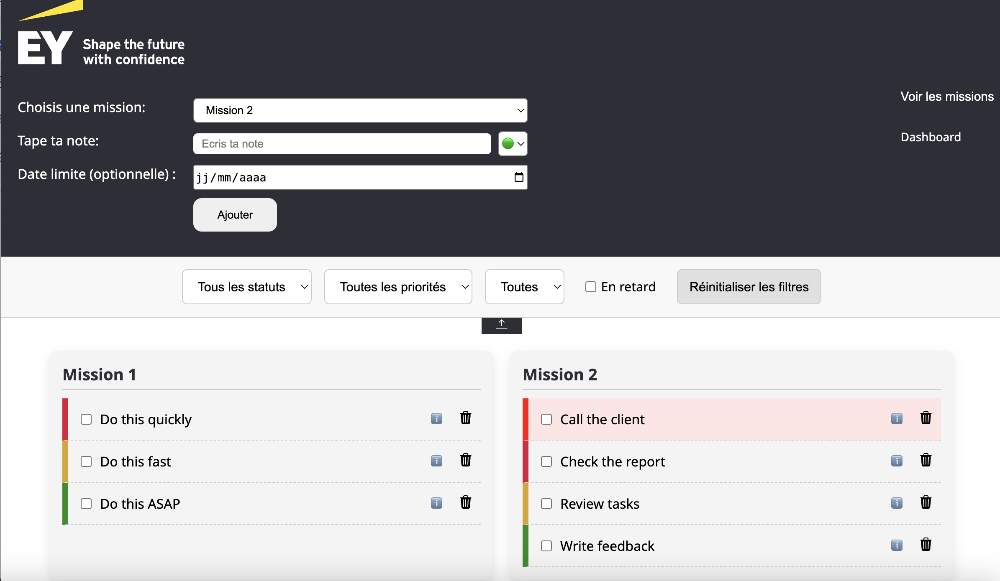

# 📝 Mission-Based To-Do List

This project is a customizable task manager that allows you to organize your tasks by **mission**, **priority**, **status**, and even **deadline**. Designed to be simple yet powerful, it features advanced filtering, analytics, and a clean interface.

## 🚀 Features

### ✅ Core Functionality

- Add **missions** and assign **tasks** to them.
- Each task has:
  - A **priority** level: 🔴 Urgent, 🟡 Medium, 🟢 Low.
  - An optional **deadline**.
  - A **status** (to-do / done).
- Delete individual tasks or entire missions (deleting a mission removes its associated tasks).

### 📊 Dashboard

- View overall statistics:
  - Total missions
  - Tasks to do
  - Tasks completed
- Visual charts using Chart.js:
  - **Global priority distribution** (doughnut chart).
  - **Tasks by mission and priority** (stacked bar chart).

### 🔍 Filters

Dynamic filtering by:

- ✅ Task status (to-do / done)
- 🎯 Priority (urgent / medium / low)
- 🎯 Mission
- 🔥 Late tasks (deadline passed)

Includes:

- "Clear filters" button
- Collapsible filter section with a toggle button

### 🧠 Task Info Panel

Each task has an "ℹ️" info button to reveal:

- Creation date
- Completion date (if any)
- Deadline (if set)

Late tasks are highlighted with a light red background.

## 💾 Persistence

All data is saved in **localStorage**, so your tasks and missions are preserved even after closing the browser.

## 🛠 Technologies

- HTML, CSS, JavaScript (ES6)
- jQuery for DOM manipulation
- Chart.js for graphs

## 📂 Folder Structure

📁 project/
├── index.html ← Main To-Do interface
├── dashboard.html ← Dashboard with analytics
├── styles.css ← All styling (shared)
├── main.js ← Core logic and filtering
├── dashboard.js ← Dashboard-specific charts
└── README.md ← This file

## 🔮 Possible Improvements

- 📅 Calendar view showing tasks by deadline or creation date
- 📧 Daily summary email with upcoming deadlines
- ⏰ Notifications or reminders
- 📥 Export to Google Sheets
- 👥 User system for sharing tasks between people
- 📱 Mobile optimization

## 📸 Preview

## 🧑‍💻 Created By

Made with ❤️ by Erdem

---
